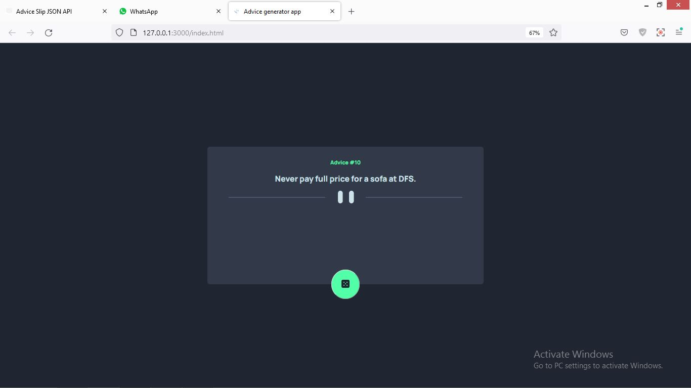
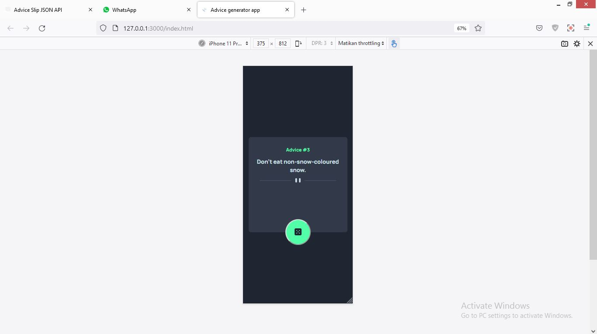

# Advice generator app

## Table of contents

- [Overview](#overview)
  - [The challenge](#the-challenge)
  - [Screenshot](#screenshot)
- [My process](#my-process)
  - [Built with](#built-with)
- [Author](#author)

## Overview

### The challenge

Users should be able to:

- View the optimal layout for the app depending on their device's screen size
- See hover states for all interactive elements on the page
- Generate a new piece of advice by clicking the dice icon

### Screenshot

## My process

### Built with

- Semantic HTML5 markup
- CSS custom properties
- API
- Mobile-first workflow

## Author

- Linkedin - [@prasetyatf](https://www.linkedin.com/in/prasetyatf)
